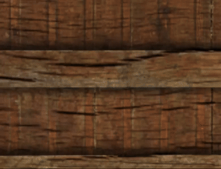

# Introduction

  

Learning OpenGL by implementing an SDK for basic shape generation and lighting manipulation.

Code is based on [learn OpenGl tutorial](https://learnopengl.com/). 

Currently implemented chapters:
- [Getting started](https://learnopengl.com/Getting-started/OpenGL)
- [Lighting](https://learnopengl.com/Lighting/Colors)
- [Model Loading](https://learnopengl.com/Model-Loading/Assimp) (in progress...)

# Build process
The building process is being implemented. The implementation is to be based on a [repository with an example](https://github.com/tgalaj/OpenGLSampleCmake).

 
Build scritp

	mkdir build
	cd build
	cmake -A x64 ..

# Run
The [runner file](https://github.com/krzywilk/open-gl-shapes-viewer/blob/master/Runner.cpp) contains an example of the use of the implemented functionalities.